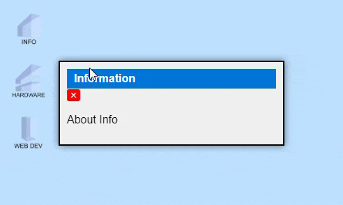
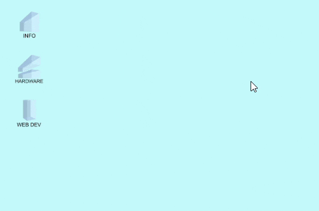

"# click-icon"

Navbar closes upon click

Tooltips added

Added new icons and shortcuts

Added a 'close all windows button'

Added fullscreen button

Improved navbar styling

Added scroll bar to window

Updated window styling

Added icon text

Added new  icons

Update: Added CRT Scan lines

Update:  Added retro font and styling

Update: Added time and date to top nav

Update: Icons show border on mouse hover

Update: Icons now draggable

Update: Nav Bar now opens on click

Update: Added Basic Nav Bar

Update: Open and close animations added

Update: Windows now rise to top of stack upon select

Update: Mouse behaviour correct on draggable click

Init

